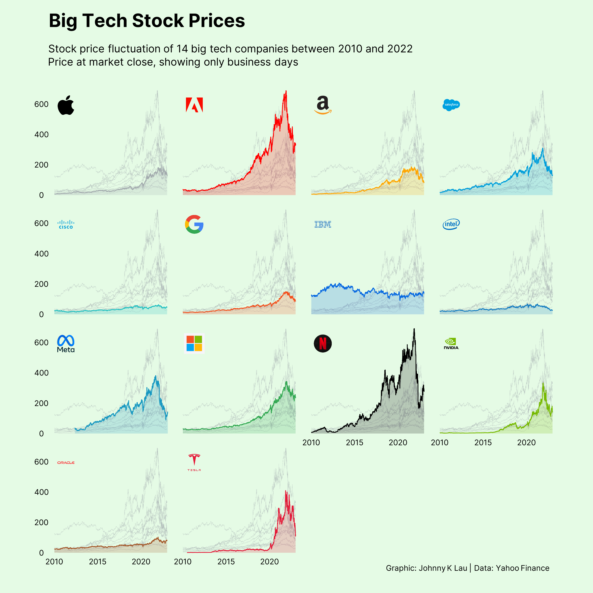
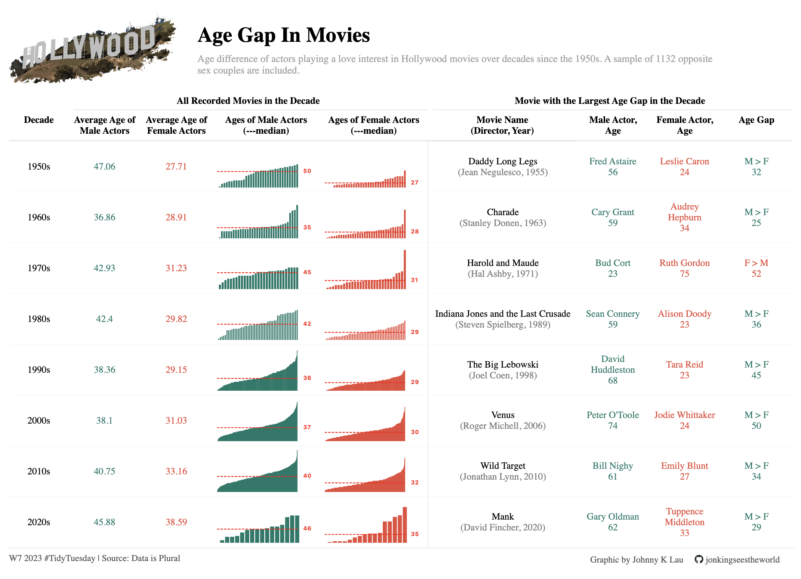
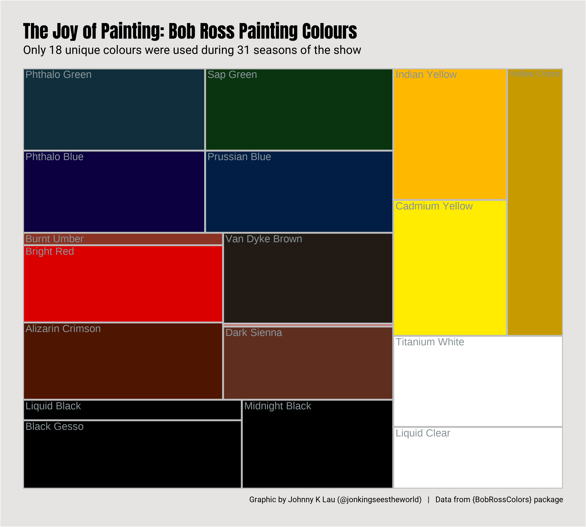

# TidyTuesday 2022

## :spiral_notepad:	&nbsp; Summary 
| Week               | Topic                | Graphic / Visual                                | Source   |
|:------------------:|----------------------|-------------------------------------------------|-----------------|
| [6](20230207wk6)   | Big Tech Stock       | Multiple line plots of time series data         | Yahoo Finance   |
| [7](20230214wk7)   | Hollywood Age Gap    | Interactive {reactable} along with html tweaks  | Data is Plural |
| [8](20230221wk8)   | Bob Ross Colours     | Treemap - static and in animation.              | {BobRossColors} package |

## :chart_with_upwards_trend: &nbsp; Visualisations 

### **[Wk6 - Big Tech Stock Prices: Changes Over Years](20230207wk6)**
Illustration of movement of stock prices of 14 big tech companies between 2010 and 2022

### **[Wk7 - Age Gap in Hollywood Movies](20230214wk7)**
Table graphic summarising analysis of the age difference between the opposite sex actors who play a love interest in movies over recent decades

### **[Wk8 - The Joy of Painting: Bob Ross's Use of Colours](20230221wk8)**
Treemap illustration showing all the unique colours (and their relative proportions) used by Bob Ross in the paintings made in all the seasons of the show 'The Joy of Painting'

