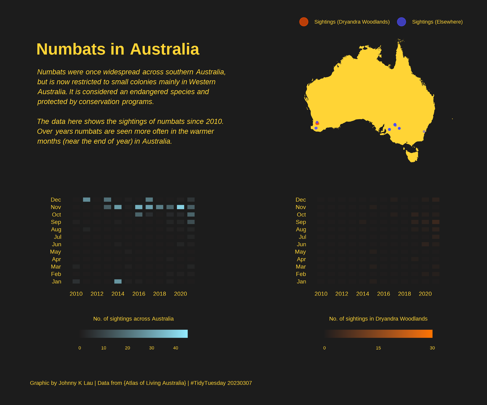
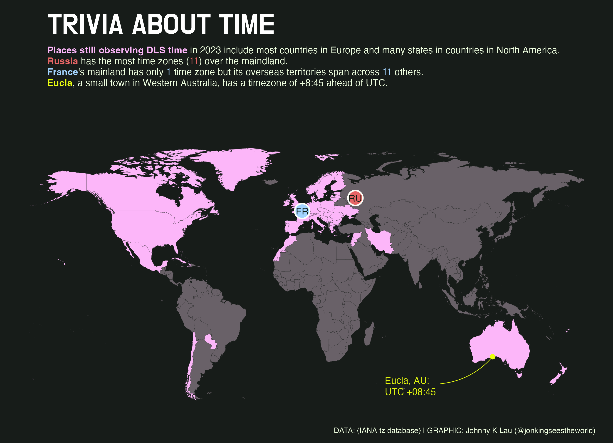
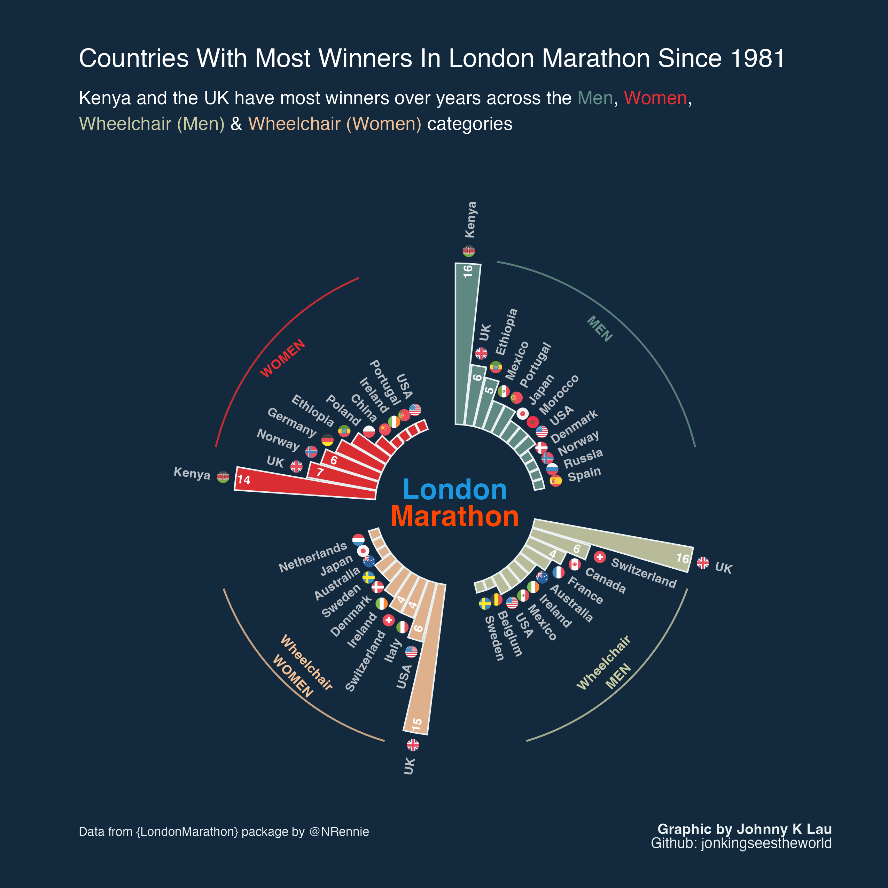
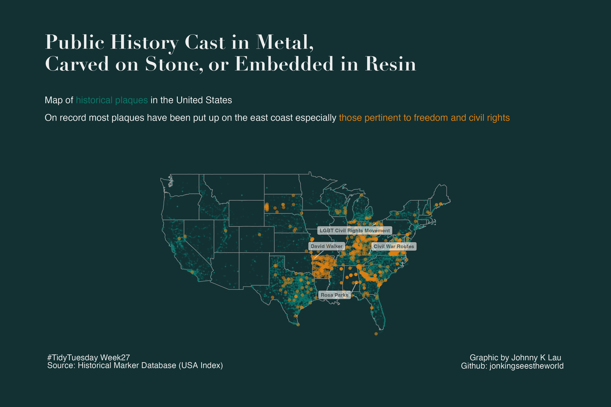

# TidyTuesday 2023

## :spiral_notepad:	&nbsp; Summary 
| Week               | Topic                | Graphic / Visual                                | Source                     |
|:------------------:|----------------------|-------------------------------------------------|----------------------------|
| [6](20230207wk6)   | Big Tech Stock       | Multiple line plots of time series data         | Yahoo Finance              |
| [7](20230214wk7)   | Hollywood Age Gap    | Interactive {reactable} along with html tweaks  | Data is Plural             |
| [8](20230221wk8)   | Bob Ross Colours     | Treemap - static and in animation               | {BobRossColors} package    |
| [10](20230307wk10) | Numbats in Oz 🐀     | Geospatial map; tile plots                      | {Atlas of Living Australia}|
| [13](20230328wk13) | Timezones in 2023    | Geospatial map; ggtext                          | IANA tz database           |
| [17](20230425wk17) | London Marathon      | Polar barplot; ggflags                         | {LondonMarathon} by NRennie |
| [27](20230704wk27) | Historical Markers in USA | Geospatial map; ggrepel                    | Historical Marker Database |

## :chart_with_upwards_trend: &nbsp; Visualisations 

### **[Wk6 - Big Tech Stock Prices: Changes Over Years](20230207wk6)**
Illustration of movement of stock prices of 14 big tech companies between 2010 and 2022

### **[Wk7 - Age Gap in Hollywood Movies](20230214wk7)**
Table graphic summarising analysis of the age difference between the opposite sex actors who play a love interest in movies over recent decades

### **[Wk8 - The Joy of Painting: Bob Ross's Use of Colours](20230221wk8)**
Treemap illustration showing all the unique colours (and their relative proportions) used by Bob Ross in the paintings made in all the seasons of the show 'The Joy of Painting'

### **[Wk10 - Numbat sightings in Oz](20230307wk10)**
Numbat is regarded as an endangered species in Oz. The data here shows the sightings of the animal since 2010. Over years numbats are spotten more often in the warmer months in Australia.

### **[Wk13 - Trivia about Time 2023](20230328wk13)** :clock1:
Which places still observe Daylight Saving time in 2023? Most European countries and states in English-speaking countries in North America and Oceania do. 

### **[Wk17 - London Marathon Winners](20230425wk17)** :running_woman: :running_man:
Countries including Kenya and the UK have the most winners in the past London Marathon events across multiple categories.

### **[Wk27 - US Map of Historical Plaques on Freedom](20230704wk27)** :rock:	:wood:
Public history cast in metal, carved on stone, or embedded in resin. On record most historical plaques have been put on the east coast states especially those related to freedom and civil rights.

