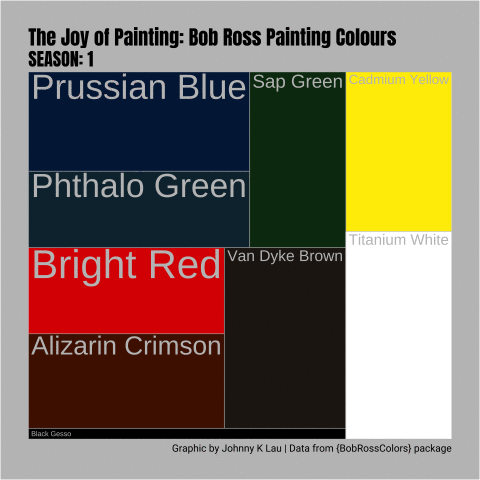
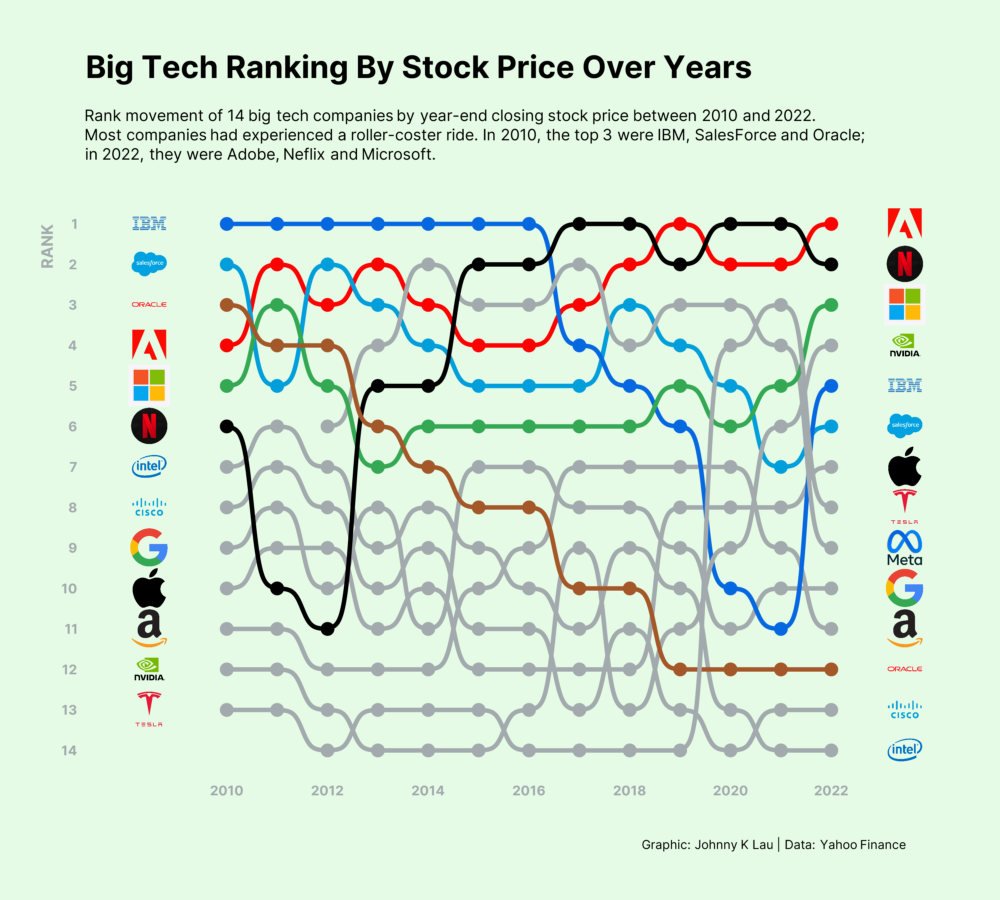
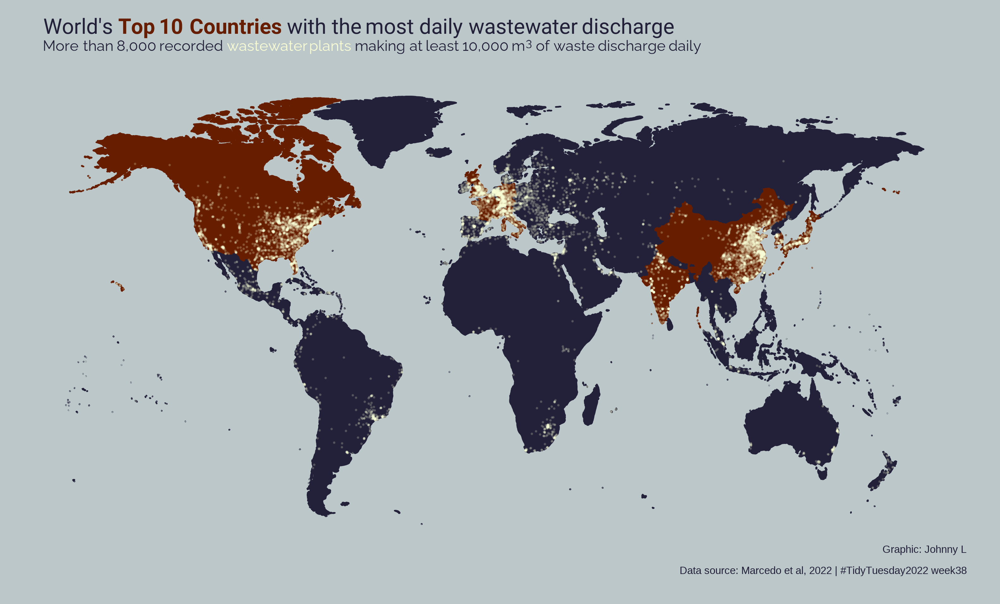
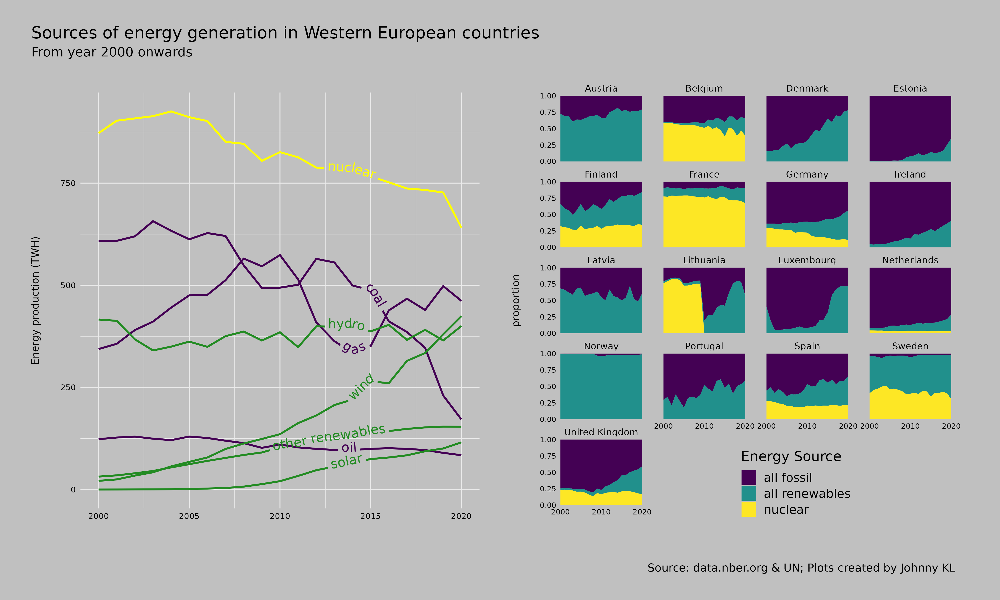

<h1 align="center">
#TidyTuesday
</h1>

Here is a collection of my data viz inspirations and attempts on the weekly data source from TidyTuesday.

## Background Information 
Taken from [R For Data Science](https://github.com/rfordatascience/tidytuesday) TidyTuesday
> TidyTuesday is a weekly data project activity aimed mainly at the R ecosystem. The project was borne out of the R4DS Online Learning Community and the R for Data Science textbook, with an emphasis on understanding how to summarize and arrange data to make meaningful charts with ggplot2, tidyr, dplyr, and other tools in the tidyverse ecosystem.

## Gallery of Examples

### **[Numbat sightings in Oz](2023/20230307wk10)**
Numbat is regarded as an endangered species in Oz. The data here shows the sightings of the animal since 2010. Over years numbats are spotten more often in the warmer months in Australia.

### **["The Joy of Painting": Colours used in Bob Ross' paintings](2023/20230221wk8/)**
**Different colours used over the seasons of the show in animation**

**All unique colours used across all 31 seasons of the show**

### **[Age Gap in Hollywood Movies](2023/20230214wk7)**

### **[Big Tech Stock](2023/20230207wk6)**
**Fluctuation in stock prices over years**

**Ranking by Stock Price over years**

### **[Wastewater Management Plants in the World](2022/wk38_20220920_waste)**

### **[Energy Generation in Western European Countries](2022/wk29_20220719_Technology)**

