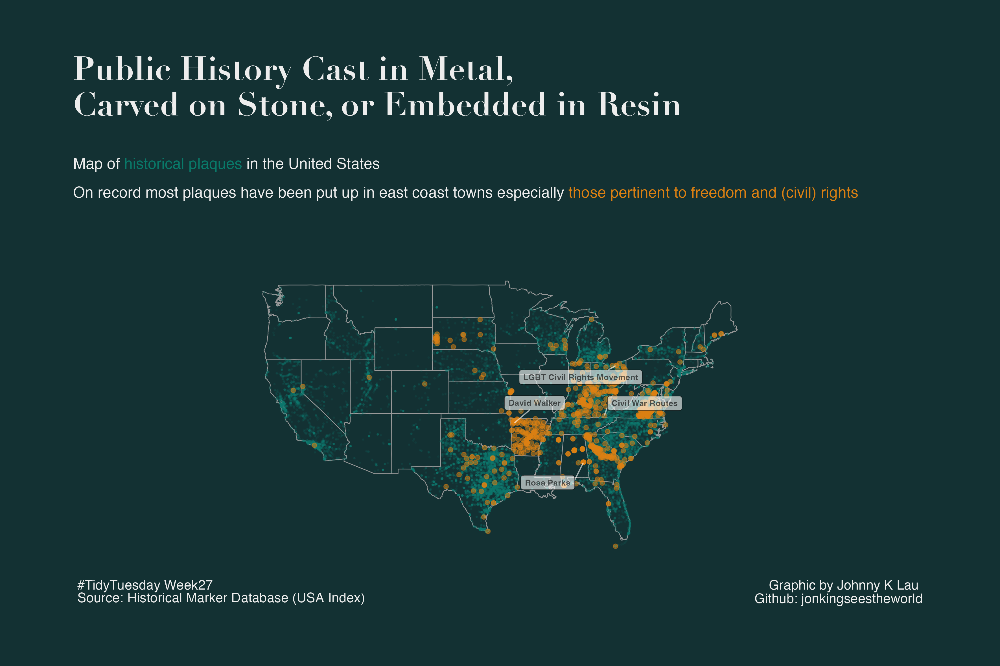
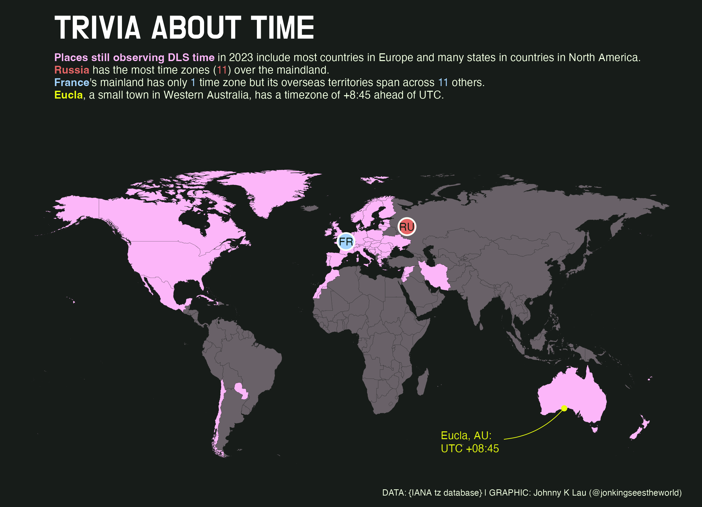

<h1 align="center">
#TidyTuesday
</h1>

Here is a collection of my data viz inspirations and attempts on the weekly data source from TidyTuesday.

## Background Information 
Taken from [R For Data Science](https://github.com/rfordatascience/tidytuesday) TidyTuesday
> TidyTuesday is a weekly data project activity aimed mainly at the R ecosystem. The project was borne out of the R4DS Online Learning Community and the R for Data Science textbook, with an emphasis on understanding how to summarize and arrange data to make meaningful charts with ggplot2, tidyr, dplyr, and other tools in the tidyverse ecosystem.

## Gallery of Examples

### **[Rising Global Temperature](2023/20230711wk28)** :chart_with_upwards_trend:
The NASA GISS Surface Tempearture Analysis estimates global surface temperature change. The estimates combine land-surface, air and sea-surface water temperature anomalies (Land-Ocean Temperature Index, L-OTI). 
Since early 1980s, the average annual temperature has increased continually.

Also, rRecreation with animation of the iconic 'warming stripes' visualisation by climatologist Ed Hawkins

### **[London Marathon Winners](2023/20230425wk17)** :running_woman: :running_man:
Countries including Kenya and the UK have the most winners in the past London Marathon events across multiple categories.

### **[US Map of Historical Plaques on Freedom](2023/20230704wk27)** :rock:	:wood:	
Public history cast in metal, carved on stone, or embedded in resin. On record most historical plaques have been put on the east coast states especially those related to freedom and civil rights.

### **[Trivia about Time 2023](2023/20230328wk13)** :clock1:
Which places still observe Daylight Saving time in 2023? Most European countries and states in English-speaking countries in North America and Oceania do. 

### **[Numbat sightings in Oz](2023/20230307wk10)** :rat:
Numbat is regarded as an endangered species in Oz. The data here shows the sightings of the animal since 2010. Over years numbats are spotten more often in the warmer months in Australia.

### **["The Joy of Painting": Colours used in Bob Ross' paintings](2023/20230221wk8/)**
**Different colours used over the seasons of the show in animation**    

**All unique colours used across all 31 seasons of the show**

### **[Age Gap in Hollywood Movies](2023/20230214wk7)**

### **[Big Tech Stock](2023/20230207wk6)**
**Fluctuation in stock prices over years**

**Ranking by Stock Price over years**

### **[Wastewater Management Plants in the World](2022/wk38_20220920_waste)**

### **[Energy Generation in Western European Countries](2022/wk29_20220719_Technology)**

